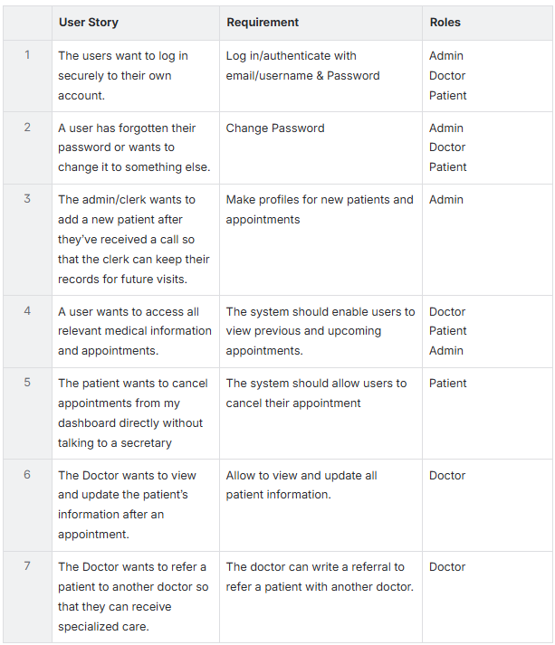

# Medical Portal App
<details open="open">
<summary>Requirements</summary>
## Patient Portal Management System
## Overview
This project is a console-based Patient Management System developed in Java. The application allows an admin to manage users (doctors, patients) and appointments, and provides functionality such as authentication, user creation, appointment scheduling, updating, cancellation, and input validation. Includes unit tests written with JUnit.

## Features
-Register new users (patients, doctors, admin)

-User authentication and password management

-Schedule, update, and cancel appointments

-View all users, view all appointments

-Simple input validation (email format, etc.)

-Console-based interface only

-Unit tests for all classes

## Project Structure
```
src/
  main/
    java/
      edu.secourse.patientportal/
        controllers/
          AppointmentController.java
          UserController.java
        models/
          User.java
          Admin.java
          Doctor.java
          Patient.java
          Appointment.java
        services/
          AppointmentService.java
          UserService.java
        AdminPortalApp.java

  test/
    java/
      edu.secourse.patientportal/
        services/
          AppointmentServiceTest.java
          UserServiceTest.java
        controllers/
          AppointmentControllerTest.java
          UserControllerTest.java
```

## Description or metaphor
The application manages patients in a doctor’s office, handling appointments, user information etc.
## High-level Requirements: 



## Uses Case : Log in
**Description:** A user (Patient, Admin or Doctor) signs into the system using their login credentials to access personalized features.

**Preconditions:**

1. The user knows a valid username or email and the associated password.
2. The user has an existing account in the system.

**Workflow:**

1. After opening the application user click on "Login" option and then it displays if the user wants to login as "patient", "admin" or "doctor".
   <br >i) **Patient**       : Upcoming appointments, cancel/reschedule options, and medical records.
   <br >ii) **Doctor**       : Patient appointments list, referral options, and patient medical history.
   <br >iii) **Admin**       : Appointment scheduling, user management.
3.  After selecting one option, a login form appear requesting username/email and password.
4. Then, after entering the requested credential, the system searches the user databases that matches with the username/email.
5. The system checks whether the submitted password corresponds to the stored password for that account.
6. If the username/email and password matche, the System will continue as "admin", "patient" or "doctor".

**Results:**

1. The User selected the role as "patient", "doctor", or "admin" and after authentication they gain access to the system.
2. Finally, the system presents the dashboard appropriate to the user’s role.

**Alternates:**

1. If no matching record exists, the system reports that the account does not exist or the username/email is invalid and prompts the user to try again or register.
2. If the password does not match, the system denies access and shows an error message, allowing the user to re-enter credentials or use password recovery.
3. If the matching user record is marked as inactive (for example, deleted patient record or disabled staff account), the system prevents login and notifies the user that the account is inactive and cannot be used.
   
**Diagram:**


## Use Case: Change password
**Description**: All users can change their own password.

**Preconditions:**

1. Users has to have an active account.
2. User is authenticated and has to know the current password.

**Workflow**:

1. The user click on “change password” field.
2. The system asks to confirm the current password in order to proceed further.
3. After confirming current password, the system displays to type new password that complies password policies( such as minimum length, upper case, lower case, special characters etc.)
4. The user then re-enter the password to match and confirm. 
5. After completing above steps user click “Save” button and the system will update the new password will show a message indicating “ The password successfully changed”.
6. Finally, the system will prompt the user to sign in again to continue further.

**Result**

1. User can access the account with new changed password.

**Alternatives**:

1. If the password doesn’t match with the record it’ll show error to user and no changes would be saved.
2. If the current password does not meet policy, the system will show specific validation error and will return to "Confirm current password" step.

**Diagram:**


## Use Case: Add New Patient

**Description**: Add new patient to the system.

**preconditions:**

1. The user adding a patient has to be an admin.
2. The admin possess the patient’s identification information.

**Workflow:**

1. The admin receives a call to add a new patient in the system.
2. The admin click “ add new patient” action and the system displays new patient form with patient information field (such as userID, first name, last name, date of birth, email, phone number, address etc.) 
3. The admin asks patients for required information and enter them in the fields.
4. The system validates the data format for all entered data or it’ll show “format incorrect”.
5. The system checks the patient folder for existing patient record using unique identifiers (such as userID, phone number, email)
6. If any field is unattended, the system going to show “data required”.
7. After clicking “submit” action if the system find any matches, then the admin can choose either “this is the same patient” or “create new patient anyway” and confirm the new patient record.
8. The system will send a verification code to phone number/email to verify the user identification.
9. After confirming  identification, the system initiate credential set for “set a temporary password” and displays it to admin for secure delivery for patient.
10. After successfully creating the new patient record, patient can change password through dashboard by themselves.

**Result**:

1. The patient can access their informations and appointments.

**Diagram:**


## Use Case: Make New Appointment

**Description**: The clerk adds a new appointment for a patient to see a doctor.

**Preconditions**: 

1. The user adding a new appointment is a clerk.
2. The new appointment is for a patient to see the doctor.

**Workflow:**

1. A patient calls the doctors office.
2. The clerk takes the patients info during the call.
3. If it is a new patient the clerk follows criteria and workflow for new patient and then continues here if necessary. 
4. The clerk cross references the patients availability with the doctor’s availability and finds a time that works for both.
5. The patient confirms appointment time.
6. The clerk enters the new appointment into the calendar using information from both the doctor and the patient.

**Results:**

1. A new appointment will be scheduled.

**Diagram:**


## Use Case: Write a Referral

**Description:** The doctor writes a referral to refer a new doctor.

**Preconditions:**

1. The patient to be referred has a record in the patient portal.
2. The doctor possesses patient information.
3. The doctor has access to the patient portal.

**Workflow:**

1. The patient visits the doctor.
2. The doctor determines the patient needs to be seen by a different specialist.
3. The doctor logs in to the patient portal.
4. The doctor writes a referral to the new doctor.
5. The doctor inserts the referral into the patient dashboard.
6. The new doctor is able to log into the portal and view the referral information.

**Results:**

1. The referral has been added to the patient’s dashboard in the patient portal.

**Alternatives:**

1. The doctor fails to log into the patient portal in step 3.
2. The doctor is unable to insert the referral into the patient dashboard in step 5.

**Diagram:**


## Use Case: Update Patient Information

**Description**: The doctor needs to view and update patient information.

**Preconditions**:

1. The doctor can log into the patient portal.
2. The doctor can view patient information.
3. The doctor can modify patient information.

**Workflow:**

1. The doctor identifies that updates need to be made to a patient’s information following a recent visit.
2. The doctor opens and logs into the patient portal.
3. The doctor views current patient information.
4. The doctor modifies specific patient information.
5. The doctor saves the updates.
6. The doctor exits the patient portal.
7. The patient logs into the patient portal.
8. The patient can now see updated medical information in the dashboard of their patient portal.

**Results:**

1. Patient information has been updated in the patient portal.

**Alternatives:**

1. The doctor is unable to log into the patient portal in step 2.
2. The doctor is not allowed to view the current patient information in step 3.
3. The doctor is unable to modify the patient’s information.
4. The doctor is unable to save updates before leaving the portal.
5. The patient is unable to log into the portal in step 7.

**Diagram:**


## Use Case: View Medical Information

**Description**: This use case describes how a doctor securely accesses a patient’s clinical record in the healthcare system.

**Preconditions**:

1. The doctor and patient both are registered and authorized users of the system.
2. The doctor is already logged into the system with valid credentials.

**Workflow**

1. After logging in, from the main dashboard, the doctor navigates to the “Patient Records” or equivalent module.
2. The doctor locates the patient by entering identifiers such as patient ID, full name or apointment number.
3. The system fetches the corresponding patient record and displays key medical information, including history, medications, test results, and visit summaries.

**Result**:

Before paying visit to the patient, doctor can take a look to patient detail history for better diagnosis.

**Diagram:**


## Use Case Name: Reschedule Appointment

**Description:** The clerk reschedules an appointment for a patient to see the doctor.

**Preconditions:** 

1. The user that is rescheduling the appointment is a clerk.
2. There is already an appointment for this Patient in the schedule.

**Workflow:**

1. A patient calls the doctors office.
2. The clerk takes the patients info during the call including when their current appointment is scheduled for and that they need it to be moved.
3. The clerk views the current schedule and suggests different available times for the patient to come to an appointment instead.
4. The patient and clerk agree on a new time that works with the current schedule.
5. The clerk enters the new time and date for the appointment into the system.
6. The clerk removes the old appointment from the system.

**Results:**

1. The patients appointment will be rescheduled for a different time.

**Diagram:**:


## Use Case: Cancel Appointment

**Description:** The process for a patient to revoke a scheduled appointment directly from their user interface in the healthcare platform.

**Preconditions:**

1. Patient has to be active and registered in the system.
2. Patient has at least one scheduled confirm appointment in future.

**Workflow**:

1. The patient accesses the system and proceeds to their personal dashboard and chooses the "Appointments" or "Schedule" section.
2. The system lists all pending and future appointments associated with the patient.
3. The patient identifies and selects the specific appointment to cancel.
4. The system requests confirmation to ensure the decision is intentional.
5. After confirming the cancelletion, the user and the doctor get notification about the cancellation of the appointment and clear the appointment record from the system.

**Result:**

1. The selected appointment is fully canceled, freeing the slot and providing the patient to reschedule appointment in future time option.

**Class Diagram**:


## CRC cards for the classes


## UML class diagram


## Mock-ups of the user interfaces

**Main Window**:


**Admin Dashboard Viewing Users**:


**Patient Dashboard**:


**Delete User Confirmation**:


## Data-flow diagrams


**Update Patient Medical Information**:


**Register a New User**:


</details>

## Design Pattern

1. **Repository Pattern** — UserRepository and AppointmentRepository abstract the database access away from the controllers. The controllers never write SQL directly.

2. **DTO-like pattern** — Our frontend User and Appointment model classes act as Data Transfer Objects, carrying data between the frontend and backend without business logic.


## Usage of AI

We used ChatGPT to learn about GitHub, troubleshooting, also understanding the concepts of API connection and database and also used to enhance the GUI.

##
